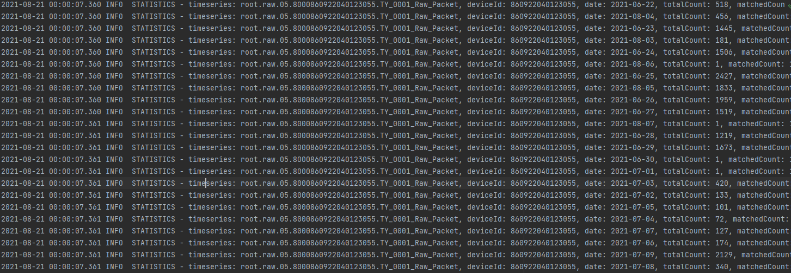
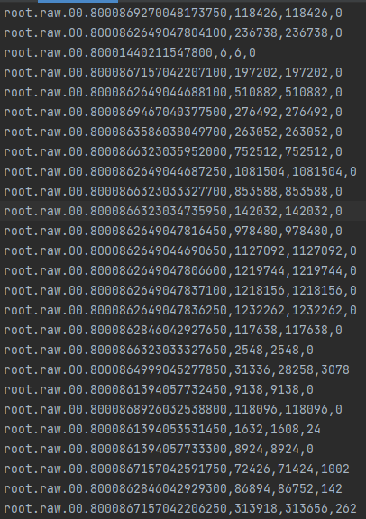
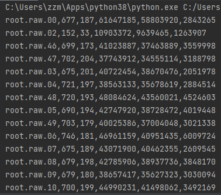

# 用于天远源码修复程序的log分析程序  
## 日期：  
2021-08-30  
##天远源码修复程序  
刘明辉  
## 本程序作用  
刘明辉程序生成info、trace等log日志  
本程序用来分析info日志  
日志长相：  
  
第一步：从全部log文件里面，摘出来如图所示的行  
第二步：分析每一行内容，按照存储组划分全部车辆、点数等信息，生成dict.txt  
分别是：存储组、总点数、正确点数、错误点数  
  
第三步，将dict分析，按照存储组输出  
分别是存储组，车辆数、总点数、正确点数、错误点数  
  

